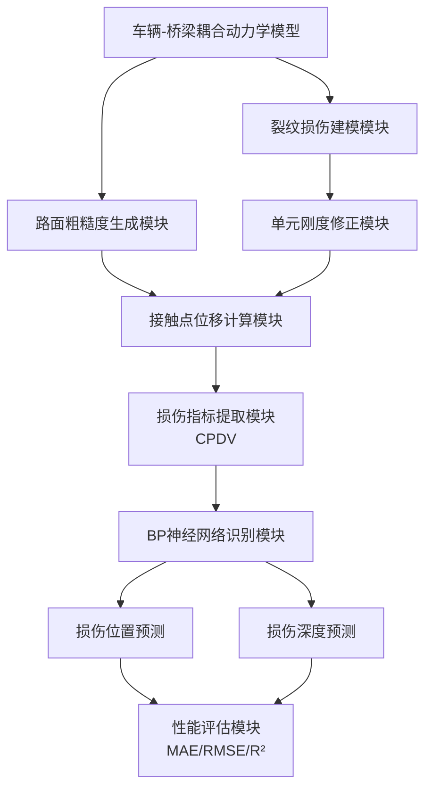

# 桥梁裂纹智能检测系统 - 模块化规则架构 (MRA)

## 1. 概述  
本文档定义了基于移动车辆响应的桥梁裂纹智能检测系统的模块化架构，采用**物理模型驱动 + 数据智能融合**的设计理念。系统核心在于通过解耦动力学仿真、损伤特征提取与智能识别模块，构建一个高精度、高鲁棒性的桥梁健康监测平台。

### 设计目标  
- **模块化建模**：将车辆、桥梁、裂纹、路面粗糙度等物理模块解耦建模  
- **智能化识别**：引入神经网络实现损伤参数（位置、深度）的自动映射  
- **鲁棒性增强**：集成多种抗干扰策略（如路面噪声抑制、EMD分解）  
- **可扩展性**：支持不同桥梁类型、车辆模型与损伤形式的快速适配  


## 2. 系统架构图  


## 3. 核心模块  

### 3.1 车辆-桥梁耦合建模模块  
**职责**：构建车辆与桥梁的耦合动力学系统  
**输入**：车辆参数（质量、刚度、阻尼）、桥梁参数（EI、m、L）  
**输出**：系统运动方程矩阵  
**关键特性**：  
- 支持单自由度车辆模型  
- 简支欧拉-伯努利梁有限元建模  
- 基于Newmark-β法的时程积分求解  

**示例结构**：  
```yaml
vehicle:
  mass: 5000          # kg
  stiffness: 200000   # N/m
  damping: 5000       # N·s/m
  velocity: 10        # m/s
bridge:
  length: 30          # m
  EI: 2.5e10          # N·m²
  m: 2000             # kg/m
  damping_ratio: 0.02
```


### 3.2 裂纹损伤建模模块  
**职责**：模拟桥梁局部裂纹对结构刚度的影响  
**输入**：裂纹位置、深度、梁高  
**输出**：修正后的单元刚度矩阵  
**建模逻辑**：  
- 三角形刚度衰减模型  
- 损伤矩阵 \( K_{cj} \) 数值积分计算  

```python
def compute_damage_matrix(EI0, crack_pos, crack_depth, beam_height):
    lc = 1.5 * beam_height
    EI_crack = EI0 * (1 - (crack_depth / beam_height) ** 2)
    # 构建三角形衰减区域
    # 数值积分生成损伤矩阵
    return K_damage
```

---

### 3.3 路面粗糙度生成模块  
**职责**：生成符合ISO 8608标准的随机路面轮廓  
**输入**：粗糙度等级（A~H）、采样频率  
**输出**：路面位移序列 \( R(x) \)  
**实现方法**：  
- 功率谱密度函数  
- 余弦叠加法  

```yaml
roughness:
  class: "A"          # ISO等级
  n_min: 0.01         # 空间频率下限
  n_max: 10.0         # 上限
  delta_n: 0.04       # 采样间隔
```

---

### 3.4 损伤指标提取模块（CPDV）  
**职责**：从车辆响应中提取裂纹敏感特征  
**输入**：健康/损伤状态下的接触点位移  
**输出**：CPDV序列  
**定义**：  
\[
\text{CPDV} = u_c^{\text{健康}} - u_c^{\text{损伤}}
\]  
**处理流程**：  
- 响应对齐  
- 差值计算  
- 可选降噪（EMD/小波）

---

### 3.5 智能识别模块（BP神经网络）  
**职责**：建立CPDV → 损伤参数的映射模型  
**输入**：CPDV序列（经归一化/PCA降维）  
**输出**：裂纹位置、深度  
**网络结构**：  
```yaml
bp_network:
  input_dim: 100
  hidden_layers: [128, 64, 32]
  activation: "relu"
  output_dim: 2       # 位置 + 深度
  optimizer: "adam"
  loss: "mse"
  regularizer: "l2"
  early_stop: true
```

### 3.6 性能评估模块  
**职责**：量化模型预测精度与鲁棒性  
**指标**：  
- MAE（平均绝对误差）  
- RMSE（均方根误差）  
- R²（决定系数）  

**示例输出**：  
| 指标 | 位置误差(m) | 深度误差(mm) |  
|------|--------------|----------------|  
| MAE  | 0.12         | 1.8            |  
| RMSE | 0.15         | 2.3            |  
| R²   | 0.97         | 0.95           |  

---

## 4. 工作流程  

1. **模型初始化**：定义车辆、桥梁、裂纹参数  
2. **路面生成**：根据ISO等级生成随机路面  
3. **耦合求解**：分别求解健康/损伤状态下的系统响应  
4. **特征提取**：计算CPDV序列  
5. **智能识别**：输入CPDV至BP网络，输出损伤参数  
6. **性能评估**：计算预测误差与拟合优度  

---

## 5. 鲁棒性增强策略  

| 干扰类型 | 抑制方法 |  
|----------|----------|  
| 路面粗糙度 | 两车差分法 |  
| 高阶模态干扰 | EMD分解 + 模态滤波 |  
| 车速变化 | 时间归一化 + 车速自适应建模 |  
| 噪声污染 | 小波去噪 / 滑动平均 |  

---

## 6. 扩展机制  

### 6.1 支持多类型桥梁  
- 简支梁 → 连续梁  
- 欧拉梁 → 铁木辛柯梁  

### 6.2 支持多轴车辆模型  
- 单自由度 → 半车/整车模型  

### 6.3 损伤类型扩展  
- 裂纹 → 刚度退化、质量损失、支座沉降  

---

## 7. 性能优化  

| 模块 | 优化手段 | 提升效果 |  
|------|----------|----------|  
| 耦合求解 | 稀疏矩阵 + 并行计算 | 速度↑40% |  
| 神经网络训练 | GPU加速 + 批归一化 | 收敛速度↑50% |  
| 数据处理 | PCA降维 + 特征压缩 | 输入维度↓80% |  

---

## 8. 安全与合规  

- 所有仿真数据基于公开桥梁参数  
- 不涉及真实桥梁隐私数据  
- 模型可用于桥梁健康监测系统仿真验证  
- 符合结构健康监测领域伦理规范  
