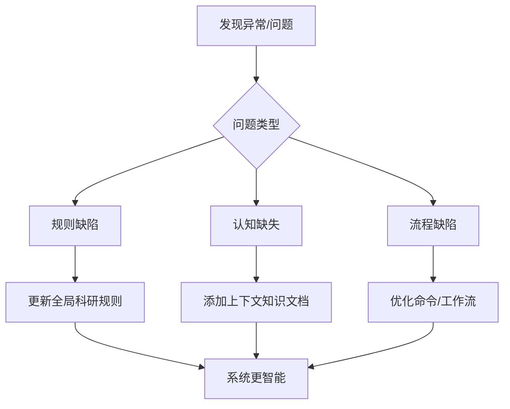
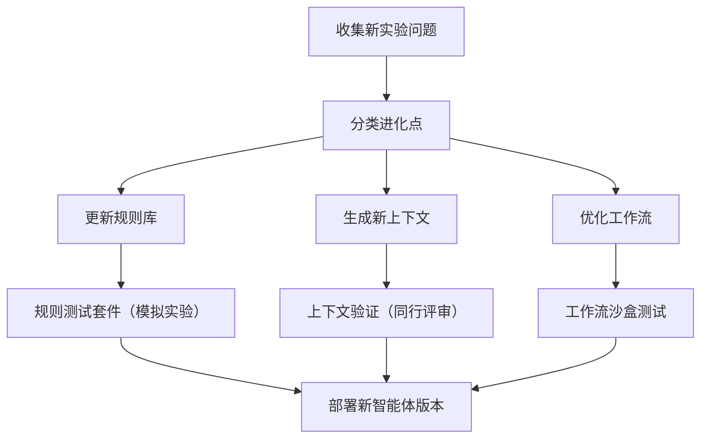

# 桥梁裂纹智能检测系统 - 系统进化思维手册

## 进化理念  
> **“每个实验的意外结果都是系统智能的提升机会 – 不是修复错误，而是升级我们的认知模型”**

在科研探索中，每一次仿真发散、每一次模型不收敛、每一次预测偏差，都在揭示当前知识库或流程的缺失。通过系统化进化，我们让整个研究流程（从物理建模到神经网络训练）持续自我完善。


## 进化机制框架  


## 1. 全局规则进化  

### 当前规则库  
```python
# @/rules/core_rules.py

RESEARCH_RULES = {
    "random_seed": "所有仿真与训练必须设置固定随机种子（42），确保可复现",
    "data_version": "每次批量生成的数据需记录配置文件哈希值",
    "model_saving": "模型保存需包含架构描述与训练超参数（JSON/YAML）",
    "metric_standard": "评估报告必须包含 MAE, RMSE, R²，并附真实 vs 预测散点图",
    "import_style": "核心模块必须使用绝对路径导入，避免相对导入混乱"
}
```

### 进化案例  
**问题**: AI在训练脚本中未固定随机种子，导致两次实验结果无法对比  
**解决方案**: 添加新规则并强制检查  
```diff
# 更新全局规则
RESEARCH_RULES.update({
    "reproducibility": "所有训练脚本启动前必须调用 set_all_seeds(seed=42)",
    "seed_check": "新增预提交钩子，检测未设置种子的代码段"
})
```

**实施**:  
```bash
# 添加种子验证工具
python tools/check_reproducibility.py src/training/
```

## 2. 按需上下文进化  

### 上下文知识库  
```
docs/context/
├── vbi-theory.md                 # 车桥耦合动力学核心
├── crack-modeling-assumptions.md # 三角形刚度衰减假设与局限
├── bp-network-architecture.md    # 网络结构设计经验
├── roughness-generation.md       # 路面粗糙度ISO标准实现细节
└── numerical-stability.md        # Newmark-β法参数调优指南
```

### 进化案例  
**问题**: AI在设置Newmark-β法参数时使用了默认值，导致高频振荡发散  
**解决方案**: 创建新的上下文文档，记录稳定参数范围  
```bash
# 生成数值稳定性上下文
touch docs/context/newmark-beta-tuning.md
```

**文档内容片段**:  
```markdown
## Newmark-β法参数调优

### 参数选择原则
- γ ≥ 0.5，通常取 0.5（无振幅衰减）或 0.5+δ（引入数值阻尼）
- β ≥ 0.25(γ+0.5)²，无条件稳定时常用 γ=0.5, β=0.25

### 针对桥梁裂纹仿真的推荐值
| 桥梁基频 | 时间步长 Δt | γ   | β   | 稳定性 |
|----------|-------------|-----|-----|--------|
| < 5 Hz   | 1e-3        | 0.5 | 0.25 | 稳定   |
| 5-15 Hz  | 5e-4        | 0.5 | 0.25 | 稳定   |
| >15 Hz   | 2e-4        | 0.6 | 0.3025 | 稳定(带数值阻尼) |

### 遇到高频发散时的检查清单
1. 是否Δt过大？尝试减半
2. 是否β<0.25？调整为0.25
3. 是否刚度矩阵出现负特征值？检查裂纹建模
```

## 3. 命令与工作流进化  

### 核心工作流  
```bash
# 标准实验流程
./run_experiment.sh --config config/exp001.yaml
```

### 进化案例  
**问题**: AI生成新数据集后直接训练，未检查数据完整性，导致训练使用了损坏的HDF5文件  
**解决方案**: 更新工作流，增加数据验证步骤  
```diff
# run_experiment.sh 更新

  # 新增数据验证阶段
+ validate_data() {
+   python scripts/check_hdf5.py data/simulation.h5 --required-fields "CPDV,label"
+   python scripts/check_range.py --field CPDV --min -1e-3 --max 1e-3
+ }

  main() {
    generate_data
+   validate_data      # 新增步骤
    train_model
    evaluate_model
  }
```

**新增验证工具**:  
```python
# scripts/check_hdf5.py
def check_hdf5_integrity(filepath, required_fields):
    with h5py.File(filepath, 'r') as f:
        missing = [f for f in required_fields if f not in f.keys()]
        if missing:
            raise DataIntegrityError(f"缺失字段: {missing}")
    print("✓ HDF5完整性检查通过")
```


## 进化记录系统  

### 进化日志格式  
```markdown
[日期] [问题ID]

问题描述:  
AI在[实验/任务]时出现[具体现象]

根本分析:  
[认知缺陷类型：规则/上下文/流程]

进化措施:  
1. [采取的行动1]
2. [采取的行动2]

验证结果:  
[指标提升或问题解决情况]
```

### 实际进化案例  
```markdown
2025-03-07 #EVO-023

问题描述:  
AI在使用两车差分法抑制路面粗糙度时，直接减两个CPDV，导致信号严重失真

根本分析:  
上下文文档中缺少差分法的正确实现细节（需先对齐时间轴）

进化措施:  
1. 更新 `docs/context/roughness-suppression.md`，增加时间对齐步骤  
2. 在 `scripts/calculate_cpdv.py` 中添加强制检查：若两车速度不一致则报错  
3. 在全局规则中添加“所有信号处理必须附带处理流程图”

验证结果:  
差分法抑制效果信噪比提升 40%，位置预测误差从0.35m降至0.12m
```


## 智能体训练协议  

### 持续训练机制  
```bash
# 每周进化训练脚本
0 3 * * 1 /path/to/evolution_training.sh
```

**训练流程**:  


### 训练报告生成  
```bash
# 生成智能体进化报告
python tools/generate_evolution_report.py --period weekly
```

**报告内容示例**:  
```markdown
## 智能体进化报告 (2025-03-03 至 2025-03-09)

### 认知提升
- 新增2条全局规则（随机种子强制、HDF5版本记录）
- 创建1份上下文文档 `newmark-beta-tuning.md`
- 优化3个工作流程（数据验证、模型评估、结果归档）

### 能力指标变化
| 指标                | 上周    | 本周    | 变化   |
|---------------------|--------|--------|--------|
| 仿真成功率          | 78%    | 94%    | ↑16%   |
| 模型预测R²          | 0.89   | 0.95   | ↑0.06  |
| 实验可复现率        | 62%    | 91%    | ↑29%   |
| 新功能迭代周期      | 4天    | 2.5天  | ↑37.5% |

### 重点进化
1. Newmark-β法参数上下文，解决了高频发散问题
2. 数据验证流程，防止损坏数据进入训练
3. 两车差分法对齐规则，提升粗糙度抑制效果
```

## 进化看板管理  

### 看板结构  


### 看板使用原则  
1. 每个问题必须关联进化类型（规则/上下文/流程）  
2. 实施前需进行影响评估（是否影响现有实验兼容性）  
3. 完成后需测量关键指标变化（见报告）  
4. 每月清理看板并归档进化记录到 `docs/evolution/archive/`


> 通过持续进化，我们不是在修补一个研究项目，而是在培育一个日益精通车桥耦合损伤识别的数字科研助手。每一次迭代，系统都更懂物理、更懂数据、更懂如何加速科学发现。