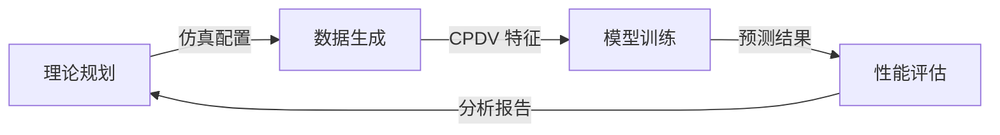

# 桥梁裂纹智能检测项目 - 上下文重置文档

## 为什么需要上下文重置  
在科研与仿真开发中，**规划与执行是分离的对话**。随着项目深入，理论假设、模型参数、数据生成逻辑、训练代码会混杂在研究者脑海中，导致“上下文窗口退化”。定期重置上下文可以：  
- 防止规划阶段的理想化假设污染执行阶段的数值实现  
- 避免过时的模型架构影响当前的调优方向  
- 确保每个实验阶段都基于干净的代码和数据状态  
- 减少认知负担，提高科研迭代效率  

## 项目专用重置协议

### 1. 仿真数据生成前重置  
**时机：** 启动新的批量数据生成任务前  
**目的：** 清除旧数据残留，确保随机种子一致性，避免前后批次混淆  
**操作：**  
```bash
# 清空临时数据缓存
rm -rf data/raw/*.h5 data/processed/*.npy

# 重置随机种子和仿真环境
python scripts/reset_simulation.py --seed 42

# 生成新的仿真配置快照
cp config/simulation.yaml config/archive/sim_$(date +%Y%m%d).yaml
```

### 2. 模型训练前重置  
**时机：** 开始新一轮模型训练前  
**目的：** 隔离不同实验的超参数组合，防止权重缓存影响  
**操作：**  
```bash
# 清理旧模型文件
rm -rf models/*.h5 models/*.pkl

# 重置训练日志和TensorBoard目录
rm -rf logs/train/* events.out.*

# 重新初始化模型权重（如果使用固定初始化）
python -c "from models.cracknet import reset_weights; reset_weights()"
```

### 3. 性能评估后重置  
**时机：** 完成一组实验结果分析后  
**目的：** 归档结果，清理临时图表，准备下一轮迭代  
**操作：**  
```bash
# 归档评估报告
mv results/evaluation.json results/archive/eval_$(date +%Y%m%d_%H%M).json

# 清除临时图表
rm -rf figures/temp_*.png

# 重置分析环境（关闭打开的notebook内核）
jupyter notebook list | grep -o ':[0-9]*' | xargs -I {} jupyter notebook stop {}
```


## 项目上下文边界

| **上下文类型**   | **关键文档/文件**                          | **边界执行**                      |
|------------------|---------------------------------------------|-----------------------------------|
| **需求规划**     | 论文草稿、研究目标、损伤模型假设             | `docs/requirements/` 目录         |
| **技术设计**     | 车桥耦合理论、神经网络架构图、数值方法       | `docs/design/` 目录                |
| **仿真执行**     | 仿真配置文件、HDF5数据文件、随机种子记录     | `config/simulation/` + `data/raw/` |
| **训练与分析**   | 训练脚本、模型文件、评估指标报告、可视化图表 | `src/training/` + `results/`       |


## 认知分离技术

### 1. 环境分离  
```bash
# 探索环境 (Jupyter Notebook) - 用于理论验证和可视化
jupyter notebook notebooks/exploration/

# 执行环境 (终端 + Python脚本) - 用于批量仿真和训练
source venv/bin/activate && cd src/
python train.py --config ../config/training.yaml
```

### 2. 数据流分离  


### 3. 时间盒分离  
```markdown
每日科研节奏:
• 09:00-10:30: 批量仿真数据生成 (执行模式)
• 10:30-11:00: 上下文重置 (清理临时文件、更新配置文件)
• 11:00-12:30: 模型训练与调参 (执行模式)
• 12:30-13:00: 上下文重置 (归档模型、记录超参数)
• 14:00-15:30: 结果分析与论文写作 (规划模式)
```

## 上下文重置检查清单

1. **清除临时生成文件**  
   ```bash
   find . -name '*.pyc' -delete
   rm -rf __pycache__/ data/temp_*.h5
   ```

2. **重置随机状态**  
   ```bash
   python -c "import numpy as np; np.random.seed(42); import tensorflow as tf; tf.random.set_seed(42)"
   ```

3. **更新仿真/训练配置**  
   ```bash
   cp config/default.yaml config/runtime/current.yaml
   # 手动编辑 current.yaml 调整参数
   ```

4. **创建重置标记**  
   ```bash
   echo "# 重置于 $(date)" > .last_reset
   git add .last_reset && git commit -m "Context reset $(date +%Y%m%d)"
   ```


## 紧急重置协议（仿真崩溃/训练发散）

当遭遇严重数值问题或训练崩溃时：  
```bash
./emergency_reset.sh --level=critical
```

**执行流程:**  
1. 立即终止所有正在运行的仿真或训练进程  
2. 备份当前配置文件到 `config/emergency_backup/`  
3. 清除所有临时数据和日志  
   ```bash
   rm -rf data/temp/ logs/error/ models/corrupt_*
   ```  
4. 重置所有随机种子和初始化参数至安全基线  
5. 生成错误分析报告（检查NaN、梯度爆炸等）  
6. 进入24小时冷却期（复查理论模型和数值稳定性）

**触发条件:**  
- 连续10次仿真返回NaN结果  
- 损失函数发散至无穷大  
- 模型预测结果完全偏离物理预期  
- 数值求解器不收敛  


## 最佳实践

1. **每日首次执行前重置**  
   ```bash
   # 添加到crontab（模拟科研工作站）
   0 9 * * * cd /path/to/project && ./scripts/daily_reset.sh
   ```

2. **关键操作后自动重置**  
   ```python
   # 在训练脚本结尾添加
   def on_train_end():
       if early_stop_triggered:
           run_reset_protocol('post_training')
   ```

3. **可视化重置状态**  
   ```bash
   python scripts/status_viewer.py --show-last-reset
   ```
